## Ulysses-curiosity

Probing task framework for Ulysses project.

---

### Table of Contents
1. [About probing tasks](#about-probing-tasks)
2. [Installation](#installation)
3. [Usage examples](#usage-examples)
    1. [Step-by-step example](#step-by-step-example)
    2. [Huggingface transformers example](#huggingface-transformers-example)
4. [References](#references)
5. [License](#license)
6. [Citation](#citation)

---

### About probing tasks

```mermaid
flowchart TB
P1(["Probing Model A"])
P2(["Probing Model B"])
P3(["Probing Model C"])

subgraph PM["Frozen pretrained model"]
    direction RL

    L1{{"Module 1"}} -->
    L2{{"Module 2"}} -->
    L3{{"Module 3"}} -->
    L4{{"Module 4"}} -->
    L5{{"Module 5"}} -->
    L6{{"Module 6"}} -->
    L7{{"..."}} -->
    L8{{"Module N"}}
end

L2 -..-> P1;
L3 -..-> P2;
L6 -..-> P3;

style PM fill:#111,stroke:#BBB;

classDef clsProbed fill:#5485D8,stroke:#103A83,stroke-width:2px;
class L2,L3,L6 clsProbed;

classDef clsProber fill:#A1425B,stroke:#AC6C7D,stroke-width:2px;
class P1,P2,P3 clsProber;
```


### Installation
```shell
python -m pip install "git+https://github.com/FelSiq/ulysses-curiosity"
```
To install developer dependencies:
```shell
python -m pip install "ulysses-curiosity[dev] @ git+https://github.com/FelSiq/ulysses-curiosity"
```

### Usage examples

#### Step-by-step example
To train probing models with this package, there are only a few steps that you should follow. The preparation is to import the package `curiosidade`, load your pretrained model, and set up a probing model that inherits from the `torch.nn.Module`. The probing model must receive as its two first `__init__` arguments the input dimension (an integer), and the output dimension (also an integer), in that order. Note that the input dimension of every probing model varies accordingly to the output dimension of the module that it is attached to, and the output dimensions depends on the nature of the probing task. (Further in this tutorial you will learn how to provide additional arguments to you model, if necessary.)
```python
# (1): import needed packages.
import curiosidade
import torch
import torch.nn
import numpy as np

# (2): load your pretrained model.
pretrained_model = load_my_pretrained_model(...)

# (3): set up your probing model.
class ProbingModel(torch.nn.Module):
    def __init__(self, input_dim: int, output_dim: int):
        super().__init__()
        self.params = torch.nn.Sequential(
            torch.nn.Linear(input_dim, 20, bias=True),
            torch.nn.ReLU(inplace=True),
            torch.nn.Linear(20, output_dim, bias=True),
        )
    
    def forward(self, X):
        return self.params(X)
```

The next step is to create a probing task instance. In this step, you must set up important aspects of the training phase, such as the train, evaluation, and test dataloaders, the loss function, the expected output dimension, and the validation metrics that should be collected during training (from every provided dataloader). Note that *evaluation and test dataloaders are optional, but recommended*. The example below show a simple set up for a probing task with 3 classes, with loss function being the Cross Entropy, and collecting the Accuracy and F1 Scores per batch. The loss function value related to every batch is collected automatically by default.

```python
import torchmetrics

num_classes = 3

# Note: here we are using 'torchmetrics' as a suggestion, but you can use whatever you like.
accuracy_fn = torchmetrics.Accuracy(num_classes=num_classes)
f1_fn = torchmetrics.F1Score(num_classes=num_classes)

def metrics_fn(logits: torch.Tensor, truth_labels: torch.Tensor) -> dict[str, float]:
    accuracy = accuracy_fn(logits, truth_labels)
    f1 = f1_fn(logits, truth_labels)
    return {"accuracy": accuracy, "f1": f1}


probing_dataloader_train = torch.utils.data.DataLoader(..., shuffle=True)
probing_dataloader_eval = torch.utils.data.DataLoader(..., shuffle=False)
probing_dataloader_test = torch.utils.data.DataLoader(..., shuffle=False)


# (4): set up your probing task.
task = curiosidade.ProbingTaskCustom(
    probing_dataloader_train=probing_dataloader_train,
    probing_dataloader_eval=probing_dataloader_eval,
    probing_dataloader_test=probing_dataloader_test,
    loss_fn=torch.nn.CrossEntropyLoss(),
    task_name="debug_task",
    task_type="classification",
    output_dim=num_classes,
    metrics_fn=metrics_fn,
)
```

Now, we need to attach the probing models to the pretrained model modules. This is easily achieved by creating a `ProbingModelFactory`, and calling `attach_probers` function. In this step you also need to provide the optimizer, used to update the probing model weights. Both the probing model and the optimizer *should not be instantiated* when provided to the ProbingModelFactory, as they will be instantiated automatically potentially many times as required to probe all pretrained model modules. The modules that should be effectively be probed are specified by their names, or a regular expression pattern that is used to match against the module names. To check the module names of your model use PyTorch's module built-in `pretrained_model.named_modules()`: `[name for name, _ in pretrained_model.named_modules() if name]`.

```python
import functools

# (5): set up a ProbingModelFactory, which combines the probing model and the probing task.
probing_factory = curiosidade.ProbingModelFactory(
    probing_model_fn=ProbingModel,  # Note: do not instantiate.
    optim_fn=functools.partial(torch.optim.Adam, lr=0.001),  # Note: do not instantiate.
    task=task,
)

# (6): attach the probing models to the pretrained model layers.
prober_container = curiosidade.core.attach_probers(
    base_model=pretrained_model,
    probing_model_factory=probing_factory,
    modules_to_attach="relu\d+",  # or a container like ["name_a", "name_b", ...]
    random_seed=16,
    device="cpu",
)

print(f"{prober_container = }")  # Summarize every configutation done so far.
print(f"{prober_container.probed_modules = }")  # Lists every probed module in 'pretrained_model'.
```

Now we are set up, so we can train our attached probing models:

```python
# (7): train probing models.
probing_results = prober_container.train(num_epochs=5)
```

Finally, the results can be aggregated to better analysis and visualization:

```python
# (8): aggregate results.
agg_cols = ["epoch", "module", "metric_name"]
agg_fns = [np.mean, np.std]

df_train = probing_results.train.to_pandas(aggregate_by=agg_cols, aggregate_fn=agg_fns)
df_eval = probing_results.eval.to_pandas(aggregate_by=agg_cols, aggregate_fn=agg_fns)
df_test = probing_results.test.to_pandas(aggregate_by=agg_cols, aggregate_fn=agg_fns)

print(df_train)
#    epoch        module metric_name    metric          
#                                         mean       std
# 0      0  params.relu1    accuracy  0.330556  0.158239
# 1      0  params.relu1          f1  0.330556  0.158239
# 2      0  params.relu1        loss  0.732363  0.050406
# 3      0  params.relu2    accuracy  0.900000  0.147358
# 4      0  params.relu2          f1  0.900000  0.147358
# 5      0  params.relu2        loss  0.531079  0.072262
# 6      1  params.relu1    accuracy  0.577778  0.226919
# ...
# 24     4  params.relu1    accuracy  0.952778  0.060880
# 25     4  params.relu1          f1  0.952778  0.060880
# 26     4  params.relu1        loss  0.399986  0.045514
# 27     4  params.relu2    accuracy  0.991667  0.028031
# 28     4  params.relu2          f1  0.991667  0.028031
# 29     4  params.relu2        loss  0.064271  0.030769
```

#### Huggingface transformers example
The process shown in the previous example should be pretty much universal for any `torch.nn.Modules`, incluing Huggingface's transformers (in PyTorch format). We will repeat the procedure shown previously, but this time probing a pretrained BERT model for Token Classification.
```python
# (1): import needed packages.
import functools

import curiosidade
import torch
import torch.nn
import transformers
import numpy as np


# (2): load your pretrained model.
bert = transformers.BertForTokenClassification.from_pretrained("<model-uri>")

# (3): set up your probing model.
class ProbingModel(torch.nn.Module):
    def __init__(self, input_dim: int, output_dim: int):
        super().__init__()
        self.params = torch.nn.Sequential(
            torch.nn.Linear(input_dim, 128),
            torch.nn.ReLU(inplace=True),
            torch.nn.Linear(128, output_dim),
        )
    
    def forward(self, X):
        out = X  # shape: (batch_size, largest_sequence_length, embed_dim=input_dim)
        out, _ = out.max(axis=1)  # shape: (batch_size, embed_dim=input_dim)
        out = self.params(out)  # shape: (batch_size, output_dim)
        return out


def accuracy_fn(logits, target):
    _, cls_ids = logits.max(axis=-1)
    return {"accuracy": (cls_ids == target).float().mean().item()}


probing_dataloader_train = torch.utils.data.DataLoader(..., shuffle=True)
probing_dataloader_eval = torch.utils.data.DataLoader(..., shuffle=False)
probing_dataloader_test = torch.utils.data.DataLoader(..., shuffle=False)
num_classes: int = ...


# (4): set up your probing task.
task = curiosidade.ProbingTaskCustom(
    probing_dataloader_train=probing_dataloader_train,
    probing_dataloader_eval=probing_dataloader_eval,
    probing_dataloader_test=probing_dataloader_test,
    loss_fn=torch.nn.CrossEntropyLoss(),
    task_name="debug_task_bert",
    output_dim=num_classes,
    metrics_fn=accuracy_fn,
)

# (5): set up a ProbingModelFactory, which combines the probing model and the probing task.
probing_factory = curiosidade.ProbingModelFactory(
    task=task,
    probing_model_fn=ProbingModel,
    optim_fn=functools.partial(torch.optim.Adam, lr=0.005),
)

# (6): attach the probing models to the pretrained model layers.
prober_container = curiosidade.core.attach_probers(
    base_model=bert,
    probing_model_factory=probing_factory,
    modules_to_attach="bert.encoder.layer.\d+.output.dense",
    device="cuda",
)

# (7): train probing models.
probing_results = prober_container.train(num_epochs=10)

# (8): aggregate results.
agg_cols = ["epoch", "module", "metric_name"]
agg_fns = [np.mean, np.std]

df_train = probing_results.train.to_pandas(aggregate_by=agg_cols, aggregate_fn=agg_fns)
df_eval = probing_results.eval.to_pandas(aggregate_by=agg_cols, aggregate_fn=agg_fns)
df_test = probing_results.test.to_pandas(aggregate_by=agg_cols, aggregate_fn=agg_fns)
```

### References
[Alexis Conneau, German Kruszewski, Guillaume Lample, Loïc Barrault, and Marco Baroni. 2018. What you can cram into a single $&!#\* vector: Probing sentence embeddings for linguistic properties. In Proceedings of the 56th Annual Meeting of the Association for Computational Linguistics (Volume 1: Long Papers), pages 2126–2136, Melbourne, Australia. Association for Computational Linguistics.](https://aclanthology.org/P18-1198/)

### License
[MIT.](LICENSE)

### Citation
```bibtex
@inproceedings{
    author="",
    date="",
}
```
